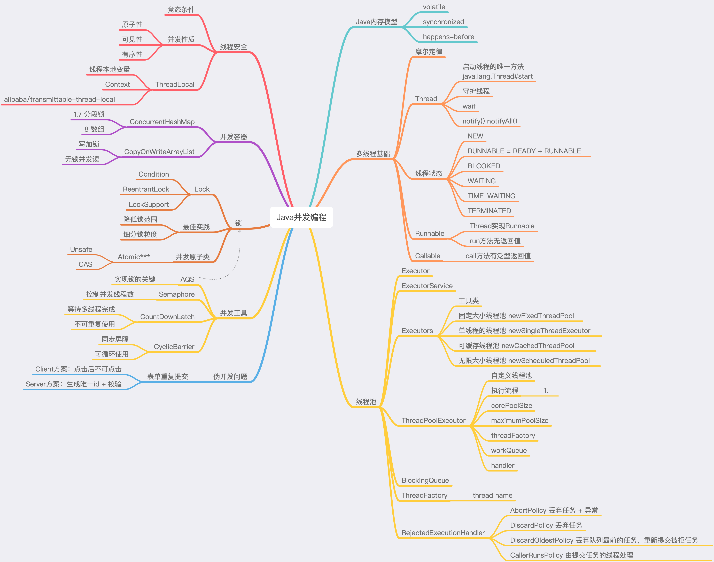

# homework

## 1. 周四作业

> （必做）思考有多少种方式，在main函数启动一个新线程或线程池，
>
> * 异步运行一个方法，拿到这个方法的返回值后，退出主线程？
>
> * 写出你的方法，越多越好，提交到github。

[作业文件](https://github.com/cchenxi/JAVA-000/blob/main/Week_04/src/main/java/io/github/cchenxi/w4/Homework03.java)

## 2. 周六作业

> （必做）把多线程和并发相关知识带你梳理一遍，画一个脑图，截图上传到github 上。

