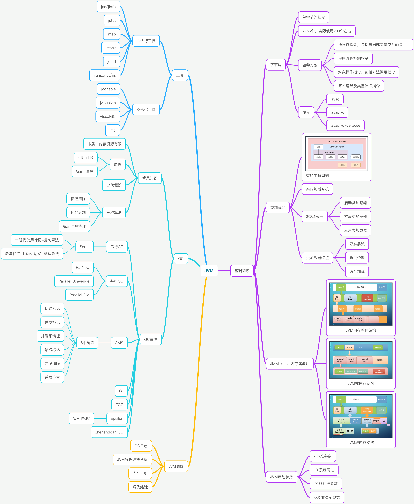
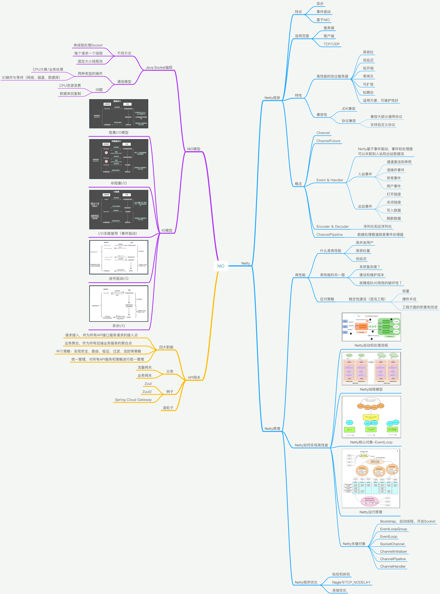
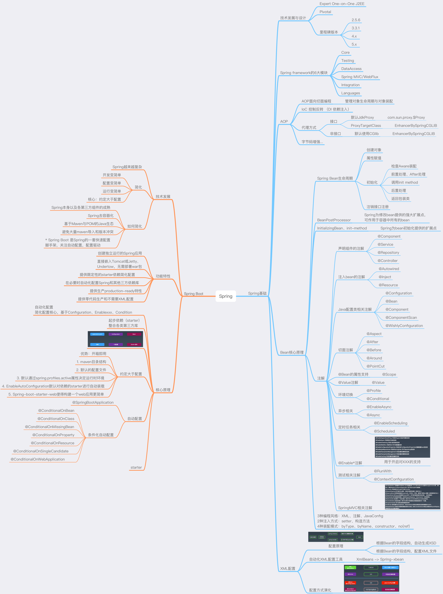
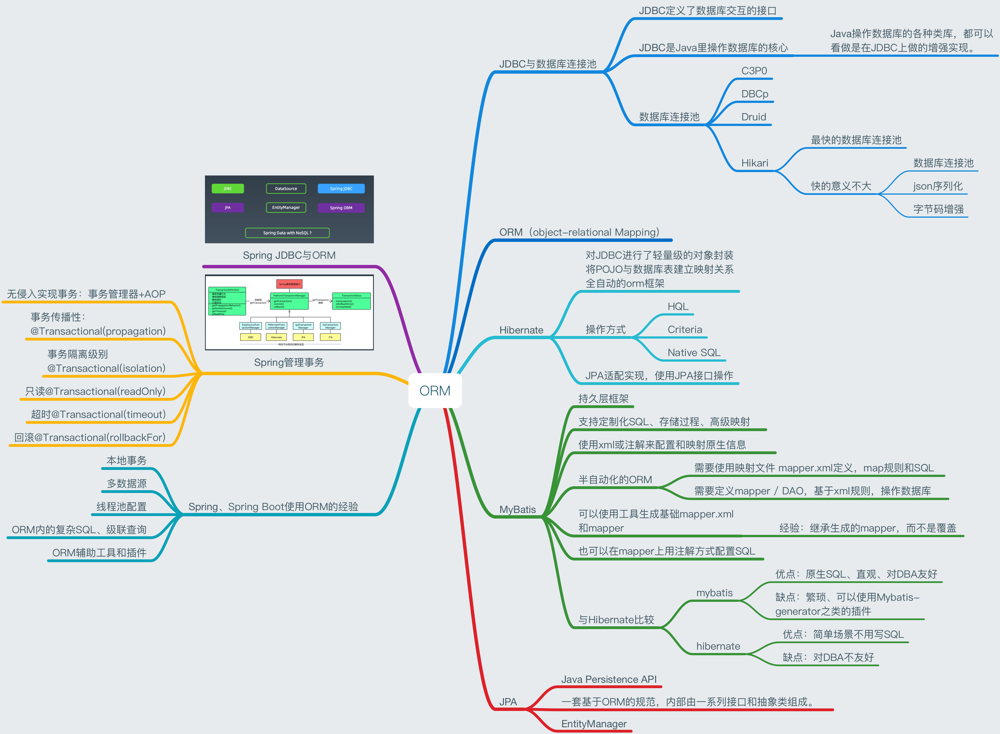

# Java进阶训练营毕业总结

## 毕业项目

> 图文总结以下知识点：
> 
> 1) JVM
> 
> 2) NIO
> 
> 3) 并发编程
> 
> 4) Spring和ORM等框架
> 
> 5) MySQL数据库和SQL
> 
> 6) 分库分表
> 
> 7) RPC和微服务
> 
> 8) 分布式缓存
> 
> 9) 分布式消息队列

### 1. JVM

### 2. NIO

### 3. 并发编程

### 4. Spring和ORM等框架

### 5. MySQL数据库和SQL

### 6. 分库分表

### 7. RPC和微服务

### 8. 分布式缓存

### 9. 分布式消息队列

## 毕业总结

